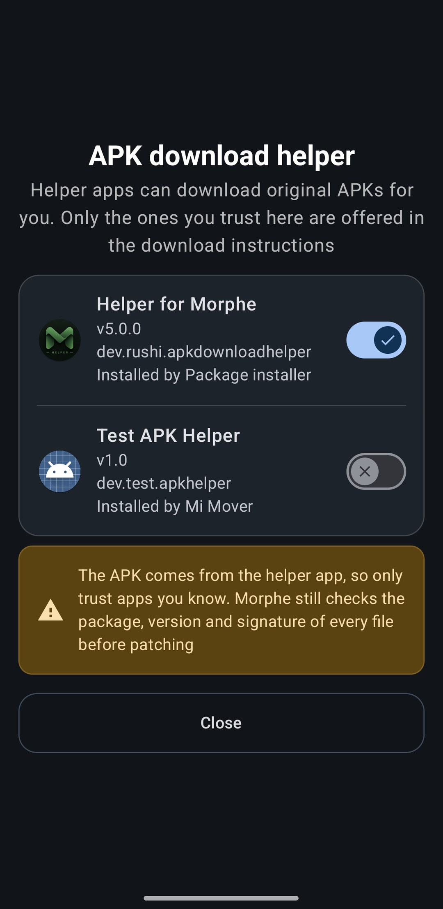

# Using an APK download helper

Patching starts with the original, unpatched APK, and TADa Manager normally sends you to a website
to fetch it by hand. A *download helper* is a separate app that does that part for you and
hands the downloaded file straight back to TADa Manager.

TADa Manager ships no helper of its own and does not endorse any. The integration is an open intent
contract: any app can implement it.

## Turning it on

**Settings → System → Files & storage → APK download helper**. The entry only appears once
an app implementing the contract is installed. It opens a list of every installed helper with
its version, package name and the app that installed it, and each helper has its own switch.
No helper is trusted by default.

  

Once at least one helper is trusted, the download instructions dialog gains a
**Use a helper app** button next to the usual **Continue** button. Only trusted helpers are
offered there.

## What happens when you use it

1. TADa Manager shows which app the file will come from and asks you to confirm. When several
   helpers are trusted, you pick one.
2. The helper opens with a description of the APK TADa Manager needs: package name, version and its
   build codes, other versions that would also work, your device ABIs, and the archive format
   the patch bundle expects.
3. The helper downloads the file and returns it. TADa Manager then treats it exactly like a file you
   picked yourself.

TADa Manager never lets a helper install anything. If an unpatched app has to be installed first for
a mount install, TADa Manager does that itself.

## What TADa Manager checks

A helper is a convenience, not a trusted source. Every file coming back goes through the same
checks as a manual selection:

- the package name matches the app you chose,
- the version is one the patch bundle supports,
- the signature matches what the patch bundle declares.

The signature check has limits worth knowing about. It needs Android 11 or newer, because
older versions cannot read a signature out of an archive file, and it needs the patch bundle
to declare the expected signatures. When TADa Manager cannot verify the signature, the confirmation
dialog says so before you continue.

## Writing a helper

The contract lives in
[`ApkDownloadHelperContract.kt`](../app/src/main/java/app/tada/manager/util/ApkDownloadHelperContract.kt).
In short, a helper declares an exported activity with an intent filter for
`app.tada.manager.action.DOWNLOAD_ORIGINAL_APK` and `android.intent.category.DEFAULT`, reads
the request from the intent extras, and answers with `RESULT_OK`, the downloaded file in
`Intent.setData`, and `FLAG_GRANT_READ_URI_PERMISSION` so TADa Manager can open it. The answer must
use a `content://` Uri; a result without the flag, or on any other scheme, is rejected before
TADa Manager reads anything.

Requests are always sent to the exact component the user picked, so a helper is never invoked
just for claiming the action.

## Troubleshooting

| Problem | What to do |
| --- | --- |
| The entry is missing in Settings | No installed app implements the contract |
| The button is missing in the dialog | No helper is trusted, or the trusted one was uninstalled since TADa Manager last looked |
| "The helper app did not return an APK" | The helper finished without handing back a file. Use **Continue** to download it manually |
| "The helper app did not grant access to the APK it returned" | The helper answered without `FLAG_GRANT_READ_URI_PERMISSION` |
| A wrong package or version warning | The helper returned a different app or version than the one requested |

## Next steps

- [Patching an app in Simple mode](patching-simple-mode.md)
- [Using the built-in file picker](file-picker.md)
